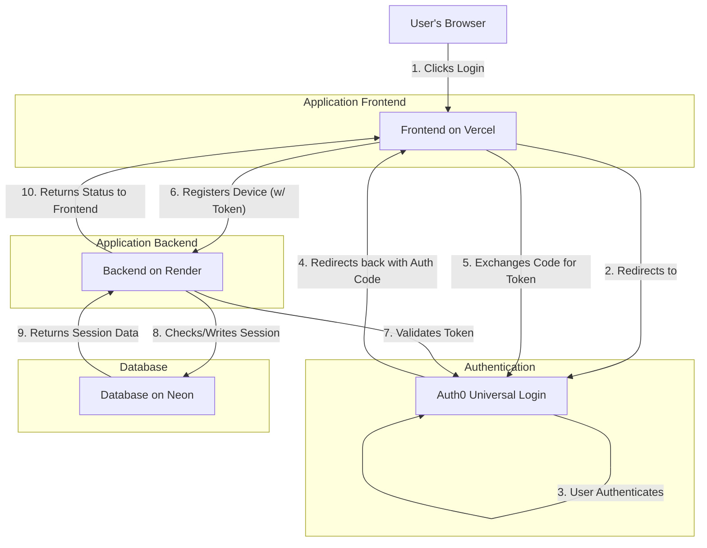

# N-Device Concurrent Session Authentication System

**Submission for the SDE Internship Task**

> A full-stack example project demonstrating a robust concurrent session management system that limits a user account to a configurable number of simultaneous devices (N = 3 in this submission). When a user attempts an (N+1)th login, they can choose a previous device to remotely log out; that kicked device receives a graceful, real-time termination notification.
> Testing User Credentials:
tester@example.com : hi_tester@1

---

## Live Demo

* **Frontend (Next.js on Vercel):** [https://3device-app.vercel.app/](https://3device-app.vercel.app/)
* **Backend (FastAPI on Render):** [https://threedevice-app.onrender.com/](https://threedevice-app.onrender.com/)

---

## Table of Contents

1. [Project Overview](#project-overview)
2. [Core Features](#core-features)
3. [System Architecture](#system-architecture)
4. [Technology Stack](#technology-stack)
5. [Platform Setup & Configuration Guide](#platform-setup--configuration-guide)

   * [Auth0 Setup](#auth0-setup)
   * [Google Cloud Console Setup](#google-cloud-console-setup)
   * [Neon (Postgres) Setup](#neon-postgres-setup)
   * [Backend Deployment (Render)](#backend-deployment-render)
   * [Frontend Deployment (Vercel)](#frontend-deployment-vercel)
6. [How to Test](#how-to-test)
7. [Notes, Known Issues & Tips](#notes-known-issues--tips)
8. [License & Credits](#license--credits)

---

## Project Overview

Standard web apps rarely control how many devices a single user can be logged into at once. This project enforces a strict **N-device** policy (here `N = 3`) at the session level. If a user logs in on a new device beyond the limit, they are shown their active sessions and can choose one to remote-terminate. The remote device gets a real-time notification informing it of session termination so the UX remains clean and predictable.

---

## Core Features

* **Secure User Authentication:** Handled by Auth0 (Universal Login, tokens).
* **N-Device Session Limit:** Enforces a max of **3** concurrent sessions per user.
* **Concurrent Session Management UI:** On (N+1)th login the user sees an active-sessions modal and can force-logout a previous device.
* **Graceful Remote Logout:** The kicked device receives a real-time `"session terminated"` notification and is redirected to login.
* **Protected Routes & API:** Profile pages and backend endpoints require valid tokens.
* **Polished UI:** Frontend built with Next.js + Tailwind CSS, responsive and clean.

---

## System Architecture



---

## Technology Stack

| Category         | Technology / Library                | Purpose                           |
| ---------------- | ----------------------------------- | --------------------------------- |
| Frontend         | Next.js / React                     | Interactive, server-aware UI      |
| Styling          | Tailwind CSS                        | Utility-first, polished UI        |
| Auth Integration | `@auth0/nextjs-auth0`               | Auth0 SDK for Next.js             |
| HTTP Client      | Axios                               | Authenticated requests to backend |
| Backend          | FastAPI (Python)                    | High-performance API              |
| ORM / Migrations | SQLAlchemy, Alembic                 | DB access & schema mgmt           |
| Database         | PostgreSQL (Neon)                   | Persistent session storage        |
| Auth Provider    | Auth0                               | Identity, tokens, social login    |
| Deployment       | Vercel (frontend), Render (backend) | Continuous deploy & hosting       |

---

## Platform Setup & Configuration Guide

### Auth0 Setup

* Create a **Regular Web Application** in Auth0 to obtain:

  * **Domain**
  * **Client ID**
  * **Client Secret**
* Application settings (example values used in this project):

  * **Allowed Callback URLs:** `https://3device-app.vercel.app/api/auth/callback`
  * **Allowed Logout URLs:** `https://3device-app.vercel.app/`
  * **Allowed Web Origins:** `https://3device-app.vercel.app/`
* **API (Auth0)**: Create a separate API resource representing the backend (gives an **Audience** such as `https://api.3device.com`) — this is used for token validation.
* **Social Connection (Google)**:

  * Enable Auth0's default Google connection.
  * For production, create OAuth keys in Google Cloud Console and paste the Client ID/Client Secret into the Auth0 Google connection settings.
  * Enable the connection for your application under the connection’s **Applications** tab.
* **Post-Login Action (Custom Action/Hook)** — Example used to add a `phone_number` custom claim:

```javascript
exports.onExecutePostLogin = async (event, api) => {
  const namespace = 'https://3device-app.com';
  if (event.user.phone_number) {
    api.idToken.setCustomClaim(`${namespace}/phone_number`, event.user.phone_number);
  }
};
```

---

### Google Cloud Console Setup

1. Create a new project in Google Cloud Console.
2. Create OAuth 2.0 Client ID (Web application).
3. Add the Auth0 redirect URI (e.g., `https://<your-auth0-domain>/login/callback`) to **Authorized redirect URIs**.
4. Copy the generated **Client ID** and **Client Secret** into Auth0’s Google connection settings.

---

### Neon (Postgres) Setup

1. Create a new project on **Neon**.
2. Provision a database and get the `DATABASE_URL` connection string.
3. Add `DATABASE_URL` to the backend service environment variables (on Render).

---

### Backend Deployment (Render)

* Create a new **Web Service** on Render connected to your GitHub repository.
* Set **Root Directory** to `backend`.
* **Build Command:** `pip install -r requirements.txt`
* **Start Command:**

  ```bash
  alembic upgrade head && uvicorn main:app --host 0.0.0.0 --port $PORT
  ```
* Environment variables to set on Render:

  * `DATABASE_URL` (from Neon)
  * `AUTH0_DOMAIN` (from Auth0)
  * `AUTH0_API_AUDIENCE` (Auth0 API Audience)
  * `MAX_SESSIONS` (set to `3` for this project)
  * Any additional keys/secrets needed by the backend

---

### Frontend Deployment (Vercel)

* Create a project on Vercel connected to the GitHub repo.
* Set **Root Directory** to `frontend`.
* Set the necessary environment variables in Vercel project settings:

  * `AUTH0_SECRET` (a securely generated random string)
  * `AUTH0_BASE_URL` (e.g., `https://3device-app.vercel.app`)
  * `AUTH0_ISSUER_BASE_URL` (the Auth0 domain URL)
  * `AUTH0_CLIENT_ID` (Auth0 application client ID)
  * `AUTH0_CLIENT_SECRET` (Auth0 application client secret)
  * `AUTH0_AUDIENCE` (the API Identifier/Audience)
  * `NEXT_PUBLIC_API_BASE_URL` (e.g., `https://threedevice-app.onrender.com`)

---

## How to Test

**Test Credentials:**
A test user was created for manual verification (see submission notes).

**Quick flow to validate N-device logic:**

1. Log in from **Device 1** (primary browser).
2. Log in from **Device 2** (different browser or profile).
3. Log in from **Device 3** (incognito or another machine).
4. Attempt login from **Device 4** — the frontend will display a **“Device Limit Reached”** modal showing the active sessions.
5. From Device 4, select a prior device to **log out**. After selecting, Device 4 becomes active.
6. The **kicked** device will receive a **“Session Terminated”** modal a few seconds later and be redirected to the login screen.

**Note on Cold Starts:**
On free Render plans, the backend may take \~30–60 seconds to wake up on the first request after inactivity. Subsequent requests are fast.

---

## Notes, Known Issues & Tips

* **Session Identification:** Sessions are registered at login with device metadata (browser, IP, timestamp, optional device name) so users can identify which device to terminate.
* **Real-time Notifications:** Implementations may use WebSockets, server-sent events, or polling for notifying remote devices. Choose the approach appropriate for scale and hosting constraints.
* **Scaling Considerations:** For higher scale, consider a distributed session store (Redis) and a pub/sub layer for session invalidation notifications.
* **Security:** Always validate access tokens server-side using Auth0’s public keys / JWKS and check the token `aud` and `iss` claims.
* **Privacy:** Keep displayed device metadata minimal (browser, last-active time) to avoid leaking sensitive info.

---

## Example Environment Variables

> Replace placeholder values with your actual values from the respective providers.

**Backend (Render)**:

```
DATABASE_URL=postgres://<user>:<pass>@<host>/<db>
AUTH0_DOMAIN=https://<your-auth0-domain>
AUTH0_API_AUDIENCE=https://api.3device.com
MAX_SESSIONS=3
```

**Frontend (Vercel)**:

```
AUTH0_SECRET=<a-secure-random-string>
AUTH0_BASE_URL=https://3device-app.vercel.app
AUTH0_ISSUER_BASE_URL=https://<your-auth0-domain>
AUTH0_CLIENT_ID=<auth0-client-id>
AUTH0_CLIENT_SECRET=<auth0-client-secret>
AUTH0_AUDIENCE=https://api.3device.com
NEXT_PUBLIC_API_BASE_URL=https://threedevice-app.onrender.com
```

---

## Export to Sheets

If you want to audit active sessions in a human-friendly format, export session records from the DB to CSV and import into Google Sheets for sorting/filtering. (Not included in repo — this is an ad-hoc recommendation.)

---

## License & Credits

* Built as a submission for an SDE internship task.
* Core libraries and platforms: Auth0, Next.js, FastAPI, SQLAlchemy/Alembic, Neon, Vercel, Render.
* If you reuse parts of this repo, please keep attribution and follow licenses of the included libraries.

---
